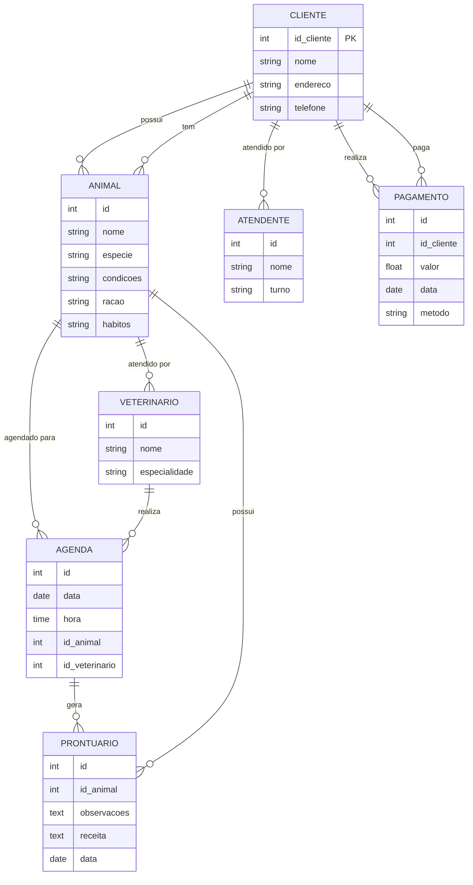
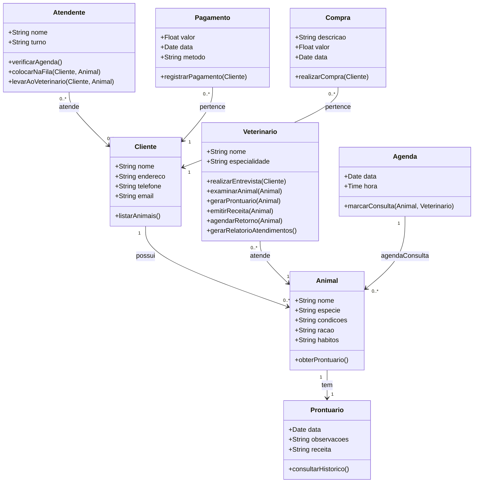
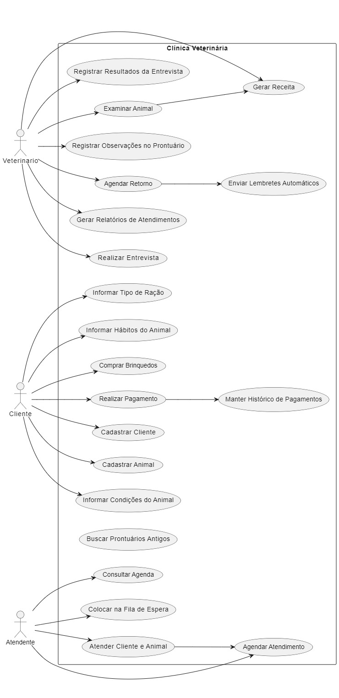
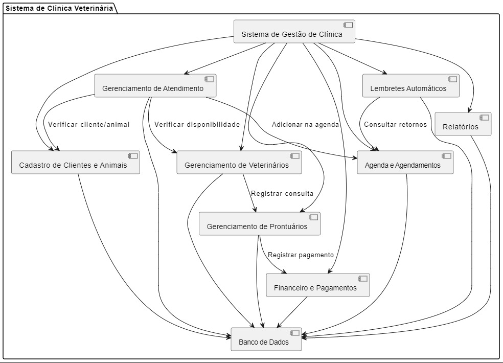
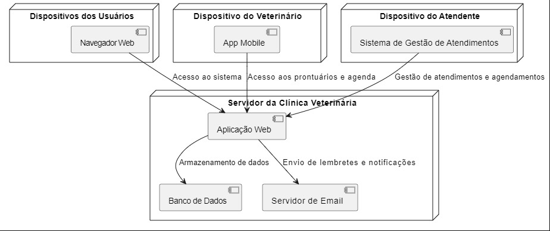
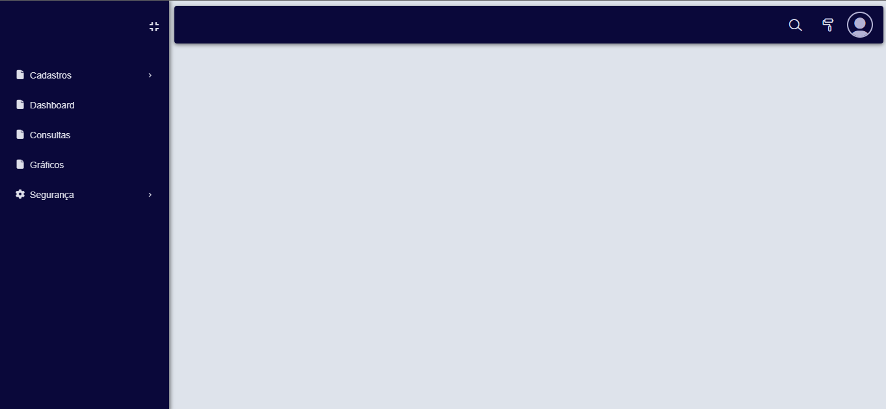
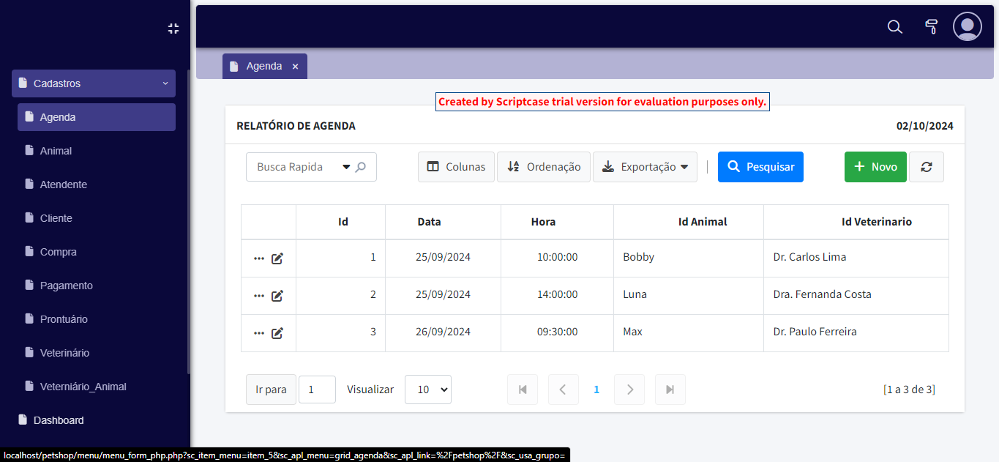
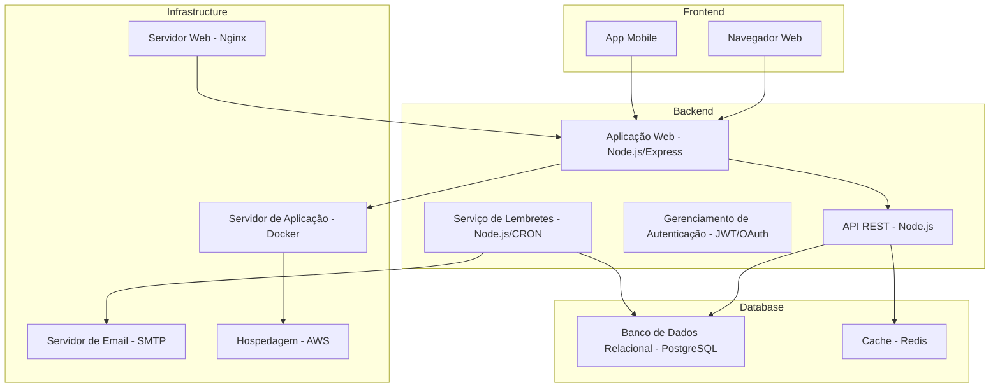

# vitor_linsbinski_engsw

Repositório destinado aos estudos relacionados à disciplina de Engenharia de Software na UNEMAT

- [vitor_linsbinski_engsw](#vitor_linsbinski_engsw)
- [1. Descrição do sistema](#1-descrição-do-sistema)
- [2. Problema e descrição do negócio](#2-problema-e-descrição-do-negócio)
- [3. Visão geral do sistema.](#3-visão-geral-do-sistema)
- [4. Diagrama ER](#4-diagrama-er)
- [5. Diagrama de classes](#5-diagrama-de-classes)
- [6. Casos de uso](#6-casos-de-uso)
  - [6.1 Histórias de usuário](#61-histórias-de-usuário)
    - [Histórias de Usuário para a Clínica Veterinária](#histórias-de-usuário-para-a-clínica-veterinária)
      - [Cadastro de Clientes e Animais](#cadastro-de-clientes-e-animais)
      - [Informar Condições do Animal](#informar-condições-do-animal)
      - [Informar Tipo de Ração](#informar-tipo-de-ração)
      - [Informar Hábitos do Animal](#informar-hábitos-do-animal)
      - [Agendamento de Atendimento](#agendamento-de-atendimento)
      - [Atendimento e Ficha do Animal](#atendimento-e-ficha-do-animal)
      - [Colocar na Fila de Espera](#colocar-na-fila-de-espera)
      - [Realizar Entrevista](#realizar-entrevista)
      - [Registrar Resultados da Entrevista](#registrar-resultados-da-entrevista)
      - [Examinar Animal e Registrar Observações](#examinar-animal-e-registrar-observações)
      - [Gerar Receita](#gerar-receita)
      - [Comprar Brinquedos](#comprar-brinquedos)
      - [Buscar Prontuários Antigos](#buscar-prontuários-antigos)
      - [Agendar Retorno](#agendar-retorno)
      - [Enviar Lembretes Automáticos](#enviar-lembretes-automáticos)
      - [Gerar Relatórios de Atendimentos](#gerar-relatórios-de-atendimentos)
      - [Realizar Pagamento](#realizar-pagamento)
      - [Manter Histórico de Pagamentos](#manter-histórico-de-pagamentos)
- [7. Diagrama de componentes](#7-diagrama-de-componentes)
- [8. Diagrama de implantação](#8-diagrama-de-implantação)
- [9. Protótipo de telas](#9-protótipo-de-telas)
- [10. Diagrama de navegação de telas](#10-diagrama-de-navegação-de-telas)
- [11. Pilha tecnológica](#11-pilha-tecnológica)
- [12. Requisitos de sistemas](#12-requisitos-de-sistemas)
  - [12.1. Requisitos do cliente](#121-requisitos-do-cliente)
  - [12.2.2 Requisitos do server side](#1222-requisitos-do-server-side)
- [13. Considerações sobre segurança](#13-considerações-sobre-segurança)
  - [13.1. Lado cliente](#131-lado-cliente)
  - [13.2. Lado servidor](#132-lado-servidor)
- [14. Manutenção e instalação](#14-manutenção-e-instalação)
  - [14.1. Instalado no servidor](#141-instalado-no-servidor)
  - [14.2. Manutenção](#142-manutenção)
  - [14.3. Novas funcionalidades](#143-novas-funcionalidades)
- [15. Treinamento](#15-treinamento)
  - [15.1. Usuário](#151-usuário)
  - [15.2. Admin](#152-admin)
- [16. Glossário](#16-glossário)
- [17. Script SQL](#17-script-sql)
  - [17.1. Comandos CREATE TABLE:](#171-comandos-create-table)
  - [17.2. Comandos INSERT gerando dados fictícios](#172-comandos-insert-gerando-dados-fictícios)

# 1. Descrição do sistema

O projeto a seguir apresenta um sistema desenvolvido para um petshop. A empresa é considerada micro e iniciou as atividades recentemente. Ao possuir serviços exclusivos, os sistemas presentes no mercado não se enquadra, desta forma, os proprietários decidiram desenvolver uma solução própria. Esta solução é detelhada a seguir:

# 2. Problema e descrição do negócio

1. Clínica veterinária atende apenas os animais: gatos e cachorros.
2. Clientes devem fazer um cadastro de si e dos animais.
3. Clientes devem informar as condições nas quais os animais chegam.
4. Clientes devem informar o tipo de ração que o animal come.
5. Cliente deve informar hábitos do animal.
6. Para cada animal, mais de um veterinário pode atendê-lo.
7. Animais podem ser atendidos de acordo com uma agenda do dia.
8. Cada animal atendido recebe uma ficha e um prontuário.
9. Outros donos podem querer marcar horários de atendimento futuro.
10. O atendimento gera uma receita para o animal.
11. Quando um cliente chega, é atendido por um atendente.
12. Atendente deve verificar se existe agenda disponível com um veterinário.
13. Atendente deve colocar o cliente e seu animal na fila de espera, se necessário.
14. Atendente deve levar o cliente e o animal até o veterinário.
15. Veterinário deve realizar uma entrevista com o dono do animal.
16. Resultado da entrevista deve ser registrado em um formulário.
17. Veterinário deve examinar o animal e anotar em prontuário suas observações.
18. Dependendo da situação, o animal receberá uma receita.
19. Clientes podem comprar brinquedos para seus animais
20. O sistema deve permitir buscar prontuários antigos para consulta.
21. Veterinários podem agendar retornos para acompanhamento do animal.
22. O sistema deve enviar lembretes automáticos aos donos sobre retornos agendados.
23. O sistema deve gerar relatórios sobre atendimentos realizados por veterinário.
24. Clientes podem pagar pelos serviços da clínica através de cartão ou dinheiro.
25. A clínica deve manter um histórico de pagamentos e faturamento dos clientes.

# 3. Visão geral do sistema.

O sistema para a clínica veterinária tem como objetivo principal facilitar a gestão de atendimentos e serviços para animais de estimação, especificamente cães e gatos. Ele proporciona um ambiente digital onde clientes podem cadastrar seus animais, agendar consultas e acompanhar o histórico médico dos pets. Por outro lado, a equipe da clínica, composta por atendentes e veterinários, pode gerenciar o fluxo de atendimento, realizar avaliações, registrar prontuários e gerar receitas médicas.

A plataforma é projetada para atender às necessidades de uma clínica de pequeno porte, automatizando tarefas administrativas e médicas, como a manutenção de agendas, o gerenciamento de filas de espera, a consulta de prontuários antigos e o envio de lembretes automáticos para os clientes. Além disso, o sistema oferece funcionalidades para a compra de produtos e serviços, bem como para o registro e acompanhamento de pagamentos, visando proporcionar uma experiência completa tanto para os profissionais da clínica quanto para os clientes.

Essa solução abrange a integração de diversas áreas, como administração, saúde animal e comércio, permitindo à clínica operar de forma mais eficiente e com maior qualidade no atendimento aos seus clientes.

# 4. Diagrama ER



# 5. Diagrama de classes



# 6. Casos de uso



## 6.1 Histórias de usuário

### Histórias de Usuário para a Clínica Veterinária

#### Cadastro de Clientes e Animais

- **Como** um cliente,
- **Quero** me cadastrar e cadastrar meu animal,
- **Para que** eu possa utilizar os serviços da clínica.

#### Informar Condições do Animal

- **Como** um cliente,
- **Quero** informar as condições nas quais meu animal chega,
- **Para que** o veterinário possa realizar uma avaliação adequada.

#### Informar Tipo de Ração

- **Como** um cliente,
- **Quero** informar o tipo de ração que meu animal come,
- **Para que** o veterinário tenha informações relevantes sobre a dieta do meu animal.

#### Informar Hábitos do Animal

- **Como** um cliente,
- **Quero** informar os hábitos do meu animal,
- **Para que** o veterinário possa entender melhor o comportamento dele.

#### Agendamento de Atendimento

- **Como** um cliente,
- **Quero** agendar um horário para atendimento do meu animal,
- **Para que** eu possa garantir que serei atendido em um momento conveniente.

#### Atendimento e Ficha do Animal

- **Como** um atendente,
- **Quero** verificar a agenda disponível com um veterinário,
- **Para que** eu possa agendar o atendimento do cliente e seu animal.

#### Colocar na Fila de Espera

- **Como** um atendente,
- **Quero** colocar o cliente e seu animal na fila de espera,
- **Para que** eles sejam atendidos assim que houver disponibilidade.

#### Realizar Entrevista

- **Como** um veterinário,
- **Quero** realizar uma entrevista com o dono do animal,
- **Para que** eu possa coletar informações relevantes para o atendimento.

#### Registrar Resultados da Entrevista

- **Como** um veterinário,
- **Quero** registrar os resultados da entrevista em um formulário,
- **Para que** haja um histórico documentado do atendimento.

#### Examinar Animal e Registrar Observações

- **Como** um veterinário,
- **Quero** examinar o animal e registrar minhas observações no prontuário,
- **Para que** eu possa acompanhar a saúde do animal ao longo do tempo.

#### Gerar Receita

- **Como** um veterinário,
- **Quero** gerar uma receita para o animal, se necessário,
- **Para que** o cliente possa adquirir os medicamentos ou tratamentos recomendados.

#### Comprar Brinquedos

- **Como** um cliente,
- **Quero** comprar brinquedos para meu animal,
- **Para que** eu possa proporcionar momentos de diversão para ele.

#### Buscar Prontuários Antigos

- **Como** um veterinário,
- **Quero** buscar prontuários antigos para consulta,
- **Para que** eu possa verificar o histórico de atendimentos do animal.

#### Agendar Retorno

- **Como** um veterinário,
- **Quero** agendar retornos para acompanhamento do animal,
- **Para que** eu possa garantir que o animal receba a atenção contínua necessária.

#### Enviar Lembretes Automáticos

- **Como** um sistema,
- **Quero** enviar lembretes automáticos aos donos sobre retornos agendados,
- **Para que** eles não esqueçam dos compromissos.

#### Gerar Relatórios de Atendimentos

- **Como** um gerente da clínica,
- **Quero** gerar relatórios sobre atendimentos realizados por veterinário,
- **Para que** eu possa analisar o desempenho e as operações da clínica.

#### Realizar Pagamento

- **Como** um cliente,
- **Quero** pagar pelos serviços da clínica através de cartão ou dinheiro,
- **Para que** eu tenha flexibilidade nas formas de pagamento.

#### Manter Histórico de Pagamentos

- **Como** um sistema,
- **Quero** manter um histórico de pagamentos e faturamento dos clientes,
- **Para que** a clínica possa ter controle financeiro e histórico de serviços prestados.

# 7. Diagrama de componentes



# 8. Diagrama de implantação



# 9. Protótipo de telas






# 10. Diagrama de navegação de telas

```mermaid
graph TD
    Login[Login] --> Menu[Menu Principal]
    Menu --> CadastroCliente[Cadastro de Cliente]
    Menu --> CadastroAnimal[Cadastro de Animal]
    Menu --> Agenda[Agenda de Atendimentos]
    Menu --> Atendimento[Atendimento]
    Menu --> Prontuario[Consulta de Prontuários]
    Menu --> Relatorios[Relatórios]
    Menu --> Pagamentos[Pagamentos e Faturamento]
    Menu --> Lembretes[Lembretes Automáticos]
    Menu --> Loja[Loja de Produtos]

    Atendimento --> Ficha[Ficha de Atendimento]
    Atendimento --> Receita[Emissão de Receita]
    Atendimento --> Entrevista[Entrevista com o Dono]
    Atendimento --> Exame[Exame do Animal]

    Agenda --> AgendarHorario[Agendar Horário]
    Agenda --> VerificarDisponibilidade[Verificar Disponibilidade]
    Agenda --> FilaDeEspera[Fila de Espera]

    Prontuario --> ConsultaAntigos[Consultar Prontuários Antigos]

    Pagamentos --> HistoricoPagamentos[Histórico de Pagamentos]
    Pagamentos --> FormaPagamento[Forma de Pagamento]

    Lembretes --> EnvioLembretes[Envio de Lembretes]

    Relatorios --> RelatorioVeterinario[Relatório por Veterinário]
    Relatorios --> RelatorioAtendimentos[Relatório de Atendimentos]

    Loja --> CompraBrinquedos[Compra de Brinquedos]
```



# 11. Pilha tecnológica



# 12. Requisitos de sistemas

## 12.1. Requisitos do cliente

O cliente precisa de um navegador que seja compatível com HTML5, CSS3 e JavaScript.

## 12.2.2 Requisitos do server side

É necessário de um hardware para hospedar o Servidor Web (Apache), Servidor de Banco de Dados (MySQL), o próprio banco de dados com os dados populados, bem como a própria aplicação.

Descrição de Hardware da Máquina Virtual:

- 2 GB de memória
- 2 vCPUs
- 20 GB de disco SSD
- 1 TB de transferência

# 13. Considerações sobre segurança

## 13.1. Lado cliente

Regras de senha: catcha, quantidade mínima de caracteres, caracteres especiais, autenticação de 2 fatores, recuperação de senha com email.

## 13.2. Lado servidor

Linux.
Política de backup de aplicação e banco.
1x/mês 1 full backup.
1x a cada 15 dias 1 full backuo.
No final de cada dia um backup incremental.
O admin do sistema não acessa dados do usuário.

# 14. Manutenção e instalação

## 14.1. Instalado no servidor

## 14.2. Manutenção

## 14.3. Novas funcionalidades

1. Formalismo do pedido
2. Cliente não dá palpite em beleza de tela
3. Decidir sob 3 critérios:
   a) Equipe tem tempo?
   b) É economicamente viável?
   c) É tecnologicamente viável?

# 15. Treinamento

## 15.1. Usuário

Vídeo na web.

## 15.2. Admin

# 16. Glossário

# 17. Script SQL

## 17.1. Comandos CREATE TABLE:

```SQL
-- Tabela de Clientes
CREATE TABLE Cliente (
    id INT AUTO_INCREMENT PRIMARY KEY,
    nome VARCHAR(100) NOT NULL,
    endereco VARCHAR(255),
    telefone VARCHAR(20),
    email VARCHAR(100),
    CONSTRAINT UC_Cliente UNIQUE (email)
);

-- Tabela de Animais
CREATE TABLE Animal (
    id INT AUTO_INCREMENT PRIMARY KEY,
    nome VARCHAR(100) NOT NULL,
    especie ENUM('gato', 'cachorro') NOT NULL,
    condicoes TEXT,
    racao VARCHAR(100),
    habitos TEXT,
    id_cliente INT,
    FOREIGN KEY (id_cliente) REFERENCES Cliente(id) ON DELETE CASCADE
);

-- Tabela de Veterinários
CREATE TABLE Veterinario (
    id INT AUTO_INCREMENT PRIMARY KEY,
    nome VARCHAR(100) NOT NULL,
    especialidade VARCHAR(100)
);

-- Tabela de Atendentes
CREATE TABLE Atendente (
    id INT AUTO_INCREMENT PRIMARY KEY,
    nome VARCHAR(100) NOT NULL,
    turno VARCHAR(50)
);

-- Tabela de Agenda para atendimento de animais
CREATE TABLE Agenda (
    id INT AUTO_INCREMENT PRIMARY KEY,
    data DATE NOT NULL,
    hora TIME NOT NULL,
    id_animal INT,
    id_veterinario INT,
    FOREIGN KEY (id_animal) REFERENCES Animal(id) ON DELETE CASCADE,
    FOREIGN KEY (id_veterinario) REFERENCES Veterinario(id) ON DELETE CASCADE
);

-- Tabela de Prontuários
CREATE TABLE Prontuario (
    id INT AUTO_INCREMENT PRIMARY KEY,
    id_animal INT,
    observacoes TEXT,
    receita TEXT,
    data DATE NOT NULL,
    FOREIGN KEY (id_animal) REFERENCES Animal(id) ON DELETE CASCADE
);

-- Tabela de Pagamentos
CREATE TABLE Pagamento (
    id INT AUTO_INCREMENT PRIMARY KEY,
    id_cliente INT,
    valor DECIMAL(10, 2) NOT NULL,
    data DATE NOT NULL,
    metodo ENUM('cartao', 'dinheiro') NOT NULL,
    FOREIGN KEY (id_cliente) REFERENCES Cliente(id) ON DELETE CASCADE
);

-- Tabela de Compras (por exemplo, brinquedos para animais)
CREATE TABLE Compra (
    id INT AUTO_INCREMENT PRIMARY KEY,
    id_cliente INT,
    descricao VARCHAR(255),
    valor DECIMAL(10, 2),
    data DATE NOT NULL,
    FOREIGN KEY (id_cliente) REFERENCES Cliente(id) ON DELETE CASCADE
);

-- Relacionamento de atendimento de mais de um veterinário por animal
CREATE TABLE Veterinario_Animal (
    id_veterinario INT,
    id_animal INT,
    PRIMARY KEY (id_veterinario, id_animal),
    FOREIGN KEY (id_veterinario) REFERENCES Veterinario(id) ON DELETE CASCADE,
    FOREIGN KEY (id_animal) REFERENCES Animal(id) ON DELETE CASCADE
);
```

## 17.2. Comandos INSERT gerando dados fictícios

```SQL
  -- Inserindo Clientes
INSERT INTO Cliente (nome, endereco, telefone, email)
VALUES
('João Silva', 'Rua A, 123', '11999999999', 'joao.silva@email.com'),
('Maria Souza', 'Rua B, 456', '11888888888', 'maria.souza@email.com'),
('Carlos Pereira', 'Rua C, 789', '11777777777', 'carlos.pereira@email.com');

-- Inserindo Animais
INSERT INTO Animal (nome, especie, condicoes, racao, habitos, id_cliente)
VALUES
('Rex', 'cachorro', 'Saudável', 'Ração Premium', 'Corre muito no parque', 1),
('Mimi', 'gato', 'Problema renal', 'Ração especial para rins', 'Gosta de dormir muito', 2),
('Bobby', 'cachorro', 'Sobrepeso', 'Ração light', 'Gosta de comer o dia todo', 3);

-- Inserindo Veterinários
INSERT INTO Veterinario (nome, especialidade)
VALUES
('Dr. Ricardo Lima', 'Clínico Geral'),
('Dra. Ana Torres', 'Dermatologia'),
('Dr. Marcos Almeida', 'Ortopedia');

-- Inserindo Atendentes
INSERT INTO Atendente (nome, turno)
VALUES
('Carla Mendes', 'Manhã'),
('Paulo Santos', 'Tarde');

-- Inserindo Agenda
INSERT INTO Agenda (data, hora, id_animal, id_veterinario)
VALUES
('2024-09-20', '10:30:00', 1, 1),
('2024-09-20', '14:00:00', 2, 2),
('2024-09-21', '09:00:00', 3, 3);

-- Inserindo Prontuários
INSERT INTO Prontuario (id_animal, observacoes, receita, data)
VALUES
(1, 'Animal saudável, sem alterações.', 'Vermífugo de 6 em 6 meses', '2024-09-20'),
(2, 'Animal com problemas renais, prescrito dieta especial.', 'Dieta renal e exames mensais', '2024-09-20'),
(3, 'Animal com sobrepeso. Prescrito ração light e exercícios.', 'Ração light e caminhadas diárias', '2024-09-21');

-- Inserindo Pagamentos
INSERT INTO Pagamento (id_cliente, valor, data, metodo)
VALUES
(1, 200.00, '2024-09-20', 'cartao'),
(2, 300.00, '2024-09-20', 'dinheiro'),
(3, 150.00, '2024-09-21', 'cartao');

-- Inserindo Compras
INSERT INTO Compra (id_cliente, descricao, valor, data)
VALUES
(1, 'Brinquedo de morder para cachorro', 50.00, '2024-09-20'),
(2, 'Arranhador para gatos', 80.00, '2024-09-20'),
(3, 'Coleira para cachorro', 30.00, '2024-09-21');

-- Inserindo Relacionamento entre Veterinários e Animais
INSERT INTO Veterinario_Animal (id_veterinario, id_animal)
VALUES
(1, 1),
(2, 2),
(3, 3),
(1, 3);  -- O animal 'Bobby' também é atendido por Dr. Ricardo Lima
```
