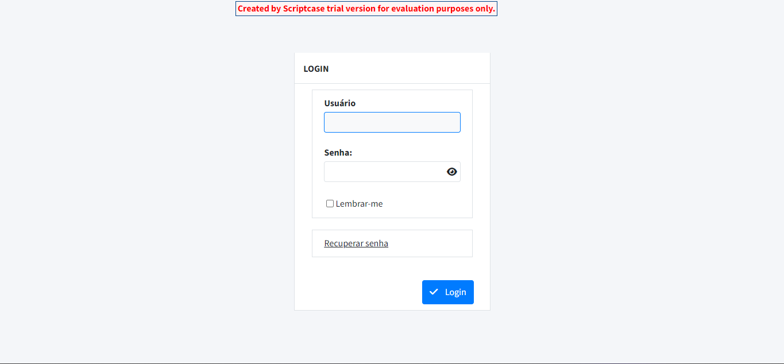
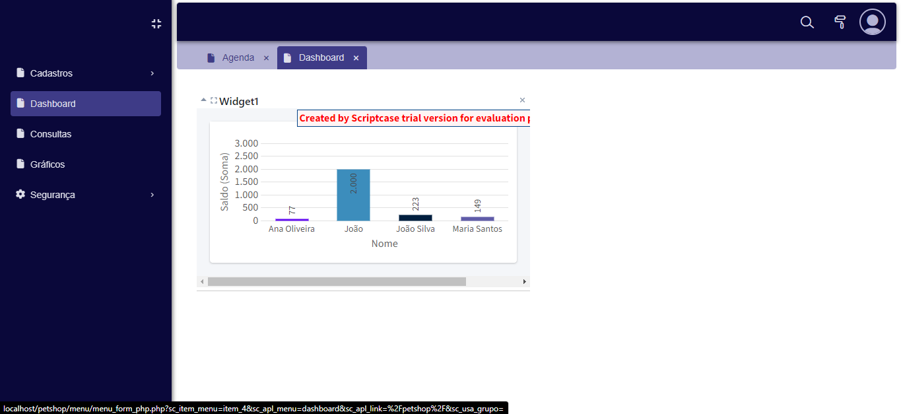

# vitor_linsbinski_engsw

Repositório destinado aos estudos relacionados à disciplina de Engenharia de Software na UNEMAT

- [vitor_linsbinski_engsw](#vitor_linsbinski_engsw)
- [1. Descrição do sistema](#1-descrição-do-sistema)
- [2. Problema e descrição do negócio](#2-problema-e-descrição-do-negócio)
- [3. Visão geral do sistema.](#3-visão-geral-do-sistema)
- [4. Diagrama ER](#4-diagrama-er)
- [5. Diagrama de classes](#5-diagrama-de-classes)
- [6. Casos de uso](#6-casos-de-uso)
  - [6.1 Histórias de usuário](#61-histórias-de-usuário)
    - [Histórias de Usuário para a Clínica Veterinária](#histórias-de-usuário-para-a-clínica-veterinária)
      - [Cadastro de Clientes e Animais](#cadastro-de-clientes-e-animais)
      - [Informar Condições do Animal](#informar-condições-do-animal)
      - [Informar Tipo de Ração](#informar-tipo-de-ração)
      - [Informar Hábitos do Animal](#informar-hábitos-do-animal)
      - [Agendamento de Atendimento](#agendamento-de-atendimento)
      - [Atendimento e Ficha do Animal](#atendimento-e-ficha-do-animal)
      - [Colocar na Fila de Espera](#colocar-na-fila-de-espera)
      - [Realizar Entrevista](#realizar-entrevista)
      - [Registrar Resultados da Entrevista](#registrar-resultados-da-entrevista)
      - [Examinar Animal e Registrar Observações](#examinar-animal-e-registrar-observações)
      - [Gerar Receita](#gerar-receita)
      - [Comprar Brinquedos](#comprar-brinquedos)
      - [Buscar Prontuários Antigos](#buscar-prontuários-antigos)
      - [Agendar Retorno](#agendar-retorno)
      - [Enviar Lembretes Automáticos](#enviar-lembretes-automáticos)
      - [Gerar Relatórios de Atendimentos](#gerar-relatórios-de-atendimentos)
      - [Realizar Pagamento](#realizar-pagamento)
      - [Manter Histórico de Pagamentos](#manter-histórico-de-pagamentos)
- [7. Diagrama de componentes](#7-diagrama-de-componentes)
- [8. Diagrama de implantação](#8-diagrama-de-implantação)
- [9. Protótipo de telas](#9-protótipo-de-telas)
- [10. Diagrama de navegação de telas](#10-diagrama-de-navegação-de-telas)
- [11. Pilha tecnológica](#11-pilha-tecnológica)
- [12. Requisitos de sistemas](#12-requisitos-de-sistemas)
  - [12.1. Requisitos do cliente](#121-requisitos-do-cliente)
  - [12.2.2 Requisitos do server side](#1222-requisitos-do-server-side)
- [13. Considerações sobre segurança](#13-considerações-sobre-segurança)
  - [13.1. Lado cliente](#131-lado-cliente)
  - [13.2. Lado servidor](#132-lado-servidor)
- [14. Manutenção e instalação](#14-manutenção-e-instalação)
  - [14.1. Instalado no servidor](#141-instalado-no-servidor)
  - [14.2. Manutenção](#142-manutenção)
  - [14.3. Novas funcionalidades](#143-novas-funcionalidades)
- [15. Treinamento](#15-treinamento)
  - [15.1. Usuário](#151-usuário)
  - [15.2. Admin](#152-admin)
- [16. Glossário](#16-glossário)
- [17. Script SQL](#17-script-sql)
  - [17.1. Comandos CREATE TABLE:](#171-comandos-create-table)
  - [17.2. Comandos INSERT gerando dados fictícios](#172-comandos-insert-gerando-dados-fictícios)

# 1. Descrição do sistema

O projeto a seguir apresenta um sistema desenvolvido para um petshop. A empresa é considerada micro e iniciou as atividades recentemente. Ao possuir serviços exclusivos, os sistemas presentes no mercado não se enquadra, desta forma, os proprietários decidiram desenvolver uma solução própria. Esta solução é detelhada a seguir:

# 2. Problema e descrição do negócio

1. Clínica veterinária atende apenas os animais: gatos e cachorros.
2. Clientes devem fazer um cadastro de si e dos animais.
3. Clientes devem informar as condições nas quais os animais chegam.
4. Clientes devem informar o tipo de ração que o animal come.
5. Cliente deve informar hábitos do animal.
6. Para cada animal, mais de um veterinário pode atendê-lo.
7. Animais podem ser atendidos de acordo com uma agenda do dia.
8. Cada animal atendido recebe uma ficha e um prontuário.
9. Outros donos podem querer marcar horários de atendimento futuro.
10. O atendimento gera uma receita para o animal.
11. Quando um cliente chega, é atendido por um atendente.
12. Atendente deve verificar se existe agenda disponível com um veterinário.
13. Atendente deve colocar o cliente e seu animal na fila de espera, se necessário.
14. Atendente deve levar o cliente e o animal até o veterinário.
15. Veterinário deve realizar uma entrevista com o dono do animal.
16. Resultado da entrevista deve ser registrado em um formulário.
17. Veterinário deve examinar o animal e anotar em prontuário suas observações.
18. Dependendo da situação, o animal receberá uma receita.
19. Clientes podem comprar brinquedos para seus animais
20. O sistema deve permitir buscar prontuários antigos para consulta.
21. Veterinários podem agendar retornos para acompanhamento do animal.
22. O sistema deve enviar lembretes automáticos aos donos sobre retornos agendados.
23. O sistema deve gerar relatórios sobre atendimentos realizados por veterinário.
24. Clientes podem pagar pelos serviços da clínica através de cartão ou dinheiro.
25. A clínica deve manter um histórico de pagamentos e faturamento dos clientes.

# 3. Visão geral do sistema.

O sistema para a clínica veterinária tem como objetivo principal facilitar a gestão de atendimentos e serviços para animais de estimação, especificamente cães e gatos. Ele proporciona um ambiente digital onde clientes podem cadastrar seus animais, agendar consultas e acompanhar o histórico médico dos pets. Por outro lado, a equipe da clínica, composta por atendentes e veterinários, pode gerenciar o fluxo de atendimento, realizar avaliações, registrar prontuários e gerar receitas médicas.

A plataforma é projetada para atender às necessidades de uma clínica de pequeno porte, automatizando tarefas administrativas e médicas, como a manutenção de agendas, o gerenciamento de filas de espera, a consulta de prontuários antigos e o envio de lembretes automáticos para os clientes. Além disso, o sistema oferece funcionalidades para a compra de produtos e serviços, bem como para o registro e acompanhamento de pagamentos, visando proporcionar uma experiência completa tanto para os profissionais da clínica quanto para os clientes.

Essa solução abrange a integração de diversas áreas, como administração, saúde animal e comércio, permitindo à clínica operar de forma mais eficiente e com maior qualidade no atendimento aos seus clientes.

# 4. Diagrama ER


# 5. Diagrama de classes


# 6. Casos de uso


## 6.1 Histórias de usuário

### Histórias de Usuário para a Clínica Veterinária

#### Cadastro de Clientes e Animais

- **Como** um cliente,
- **Quero** me cadastrar e cadastrar meu animal,
- **Para que** eu possa utilizar os serviços da clínica.

#### Informar Condições do Animal

- **Como** um cliente,
- **Quero** informar as condições nas quais meu animal chega,
- **Para que** o veterinário possa realizar uma avaliação adequada.

#### Informar Tipo de Ração

- **Como** um cliente,
- **Quero** informar o tipo de ração que meu animal come,
- **Para que** o veterinário tenha informações relevantes sobre a dieta do meu animal.

#### Informar Hábitos do Animal

- **Como** um cliente,
- **Quero** informar os hábitos do meu animal,
- **Para que** o veterinário possa entender melhor o comportamento dele.

#### Agendamento de Atendimento

- **Como** um cliente,
- **Quero** agendar um horário para atendimento do meu animal,
- **Para que** eu possa garantir que serei atendido em um momento conveniente.

#### Atendimento e Ficha do Animal

- **Como** um atendente,
- **Quero** verificar a agenda disponível com um veterinário,
- **Para que** eu possa agendar o atendimento do cliente e seu animal.

#### Colocar na Fila de Espera

- **Como** um atendente,
- **Quero** colocar o cliente e seu animal na fila de espera,
- **Para que** eles sejam atendidos assim que houver disponibilidade.

#### Realizar Entrevista

- **Como** um veterinário,
- **Quero** realizar uma entrevista com o dono do animal,
- **Para que** eu possa coletar informações relevantes para o atendimento.

#### Registrar Resultados da Entrevista

- **Como** um veterinário,
- **Quero** registrar os resultados da entrevista em um formulário,
- **Para que** haja um histórico documentado do atendimento.

#### Examinar Animal e Registrar Observações

- **Como** um veterinário,
- **Quero** examinar o animal e registrar minhas observações no prontuário,
- **Para que** eu possa acompanhar a saúde do animal ao longo do tempo.

#### Gerar Receita

- **Como** um veterinário,
- **Quero** gerar uma receita para o animal, se necessário,
- **Para que** o cliente possa adquirir os medicamentos ou tratamentos recomendados.

#### Comprar Brinquedos

- **Como** um cliente,
- **Quero** comprar brinquedos para meu animal,
- **Para que** eu possa proporcionar momentos de diversão para ele.

#### Buscar Prontuários Antigos

- **Como** um veterinário,
- **Quero** buscar prontuários antigos para consulta,
- **Para que** eu possa verificar o histórico de atendimentos do animal.

#### Agendar Retorno

- **Como** um veterinário,
- **Quero** agendar retornos para acompanhamento do animal,
- **Para que** eu possa garantir que o animal receba a atenção contínua necessária.

#### Enviar Lembretes Automáticos

- **Como** um sistema,
- **Quero** enviar lembretes automáticos aos donos sobre retornos agendados,
- **Para que** eles não esqueçam dos compromissos.

#### Gerar Relatórios de Atendimentos

- **Como** um gerente da clínica,
- **Quero** gerar relatórios sobre atendimentos realizados por veterinário,
- **Para que** eu possa analisar o desempenho e as operações da clínica.

#### Realizar Pagamento

- **Como** um cliente,
- **Quero** pagar pelos serviços da clínica através de cartão ou dinheiro,
- **Para que** eu tenha flexibilidade nas formas de pagamento.

#### Manter Histórico de Pagamentos

- **Como** um sistema,
- **Quero** manter um histórico de pagamentos e faturamento dos clientes,
- **Para que** a clínica possa ter controle financeiro e histórico de serviços prestados.

# 7. Diagrama de componentes


# 8. Diagrama de implantação


# 9. Protótipo de telas






# 10. Diagrama de navegação de telas


# 11. Pilha tecnológica


# 12. Requisitos de sistemas

## 12.1. Requisitos do cliente

Para garantir o correto funcionamento do sistema na parte do cliente, os seguintes requisitos são necessários:

Navegador Web Compatível: O sistema é acessível através de navegadores modernos que suportem as tecnologias HTML5, CSS3 e JavaScript. Recomenda-se o uso das versões mais recentes dos seguintes navegadores:

Google Chrome (versão 90 ou superior)
Mozilla Firefox (versão 88 ou superior)
Microsoft Edge (versão 90 ou superior)
Safari (versão 14 ou superior)
Conexão à Internet: É necessário ter uma conexão estável à internet para acessar o sistema, realizar cadastros, agendar atendimentos e utilizar todas as funcionalidades disponíveis.

Dispositivos Suportados: O sistema é responsivo e pode ser acessado tanto em desktops quanto em dispositivos móveis, como smartphones e tablets. As seguintes especificações mínimas são recomendadas:

Desktop:
Processador: Intel Core i3 ou equivalente
Memória RAM: 4 GB
Resolução de Tela: 1366x768 pixels
Dispositivos Móveis:
Sistema Operacional: Android 8.0 ou superior, iOS 12 ou superior
Navegadores Compatíveis: Versões móveis dos navegadores mencionados acima
Software Adicional:

JavaScript Ativado: Necessário para o funcionamento dinâmico das páginas.
Cookies Habilitados: Utilizados para manter sessões de usuários e personalizar a experiência.

## 12.2.2 Requisitos do server side

O ambiente de servidor deve atender aos seguintes requisitos para hospedar e operar o sistema de forma eficiente:

Hardware da Máquina Virtual
Memória RAM: Mínimo de 2 GB
Processador: 2 vCPUs
Armazenamento: 20 GB de disco SSD
Largura de Banda: 1 TB de transferência mensal
Software e Tecnologias
Sistema Operacional:
Linux (preferencialmente distribuições como Ubuntu 20.04 LTS ou Debian 10)
Servidor Web:
Apache (versão 2.4 ou superior)
MySQL (versão 5.7 ou superior)
Ambiente de Execução:
Node.js (versão 14 ou superior) para a aplicação backend
Gerenciamento de Dependências:
npm (Node Package Manager) ou yarn
Ferramentas de Containerização:
Docker para facilitar a implantação e escalabilidade da aplicação
Serviços de Email:
SMTP Server configurado para envio de notificações e lembretes automáticos
Segurança e Autenticação:
JWT/OAuth para gerenciamento de autenticação e autorização
Serviços de Cache:
Redis para otimização de desempenho e armazenamento de sessões

# 13. Considerações sobre segurança

## 13.1. Lado cliente

Para garantir a segurança dos dados e a integridade das operações no lado cliente, as seguintes medidas são implementadas:

Regras de Senha:

Complexidade: Senhas devem conter no mínimo 8 caracteres, incluindo letras maiúsculas, minúsculas, números e caracteres especiais.
Validação de Captcha: Implementação de Captcha nos formulários de cadastro e login para prevenir ataques de força bruta e bots automatizados.
Autenticação de Dois Fatores (2FA): Opção para os usuários habilitarem a 2FA, adicionando uma camada extra de segurança ao processo de login.
Recuperação de Senha: Processo seguro de recuperação de senha através de links temporários enviados para o email registrado, garantindo que apenas o proprietário do email possa redefinir a senha.
Proteção contra XSS e CSRF:

Sanitização de Inputs: Todos os dados inseridos pelos usuários são sanitizados para prevenir ataques de Cross-Site Scripting (XSS).
Tokens CSRF: Implementação de tokens CSRF em formulários para prevenir ataques de Cross-Site Request Forgery (CSRF).
Comunicação Segura:

HTTPS: Todas as comunicações entre o cliente e o servidor são criptografadas utilizando SSL/TLS para proteger os dados em trânsito.
Armazenamento Seguro de Dados:

Criptografia de Dados Sensíveis: Informações sensíveis armazenadas no navegador, como tokens de sessão, são criptografadas para evitar acessos não autorizados.

## 13.2. Lado servidor

No lado do servidor, as seguintes práticas e políticas de segurança são adotadas:

Sistema Operacional Seguro:
Utilização de Linux com atualizações regulares para corrigir vulnerabilidades.
Política de Backups:
Backup Completo: Realizado uma vez por mês.
Backup Completo Quinzenal: Realizado a cada 15 dias.
Backup Incremental Diário: Realizado no final de cada dia para garantir a recuperação de dados atualizados.
Gerenciamento de Acesso:
Princípio do Menor Privilégio: Administradores e usuários do sistema possuem apenas as permissões necessárias para desempenhar suas funções.
Autenticação e Autorização: Utilização de JWT/OAuth para garantir que apenas usuários autenticados e autorizados tenham acesso a determinadas funcionalidades e dados.
Proteção de Dados:
Criptografia em Descanso: Dados sensíveis armazenados no banco de dados são criptografados.
Política de Não Acesso de Admin: Administradores do sistema não têm acesso direto aos dados dos usuários, garantindo a privacidade e confidencialidade das informações.
Monitoramento e Logs:
Logs de Acesso e Erros: Monitoramento contínuo dos logs para identificar e responder a atividades suspeitas ou anômalas.
Atualizações e Patches:
Aplicação regular de atualizações de segurança e patches para todos os softwares e dependências utilizados no servidor.
Firewall e Segurança de Rede:
Configuração de firewall para permitir apenas o tráfego necessário e bloquear tentativas de acesso não autorizadas.
Proteção contra Ataques DDoS:
Implementação de medidas para mitigar ataques de negação de serviço distribuída (DDoS), garantindo a disponibilidade do sistema.

# 14. Manutenção e instalação

## 14.1. Instalado no servidor

## 14.2. Manutenção

A manutenção do sistema é essencial para garantir seu funcionamento contínuo, seguro e eficiente. As atividades de manutenção incluem:

Atualizações de Software:
Aplicação regular de atualizações de segurança para o sistema operacional, servidores web, banco de dados e dependências da aplicação.
Monitoramento de Performance:
Utilização de ferramentas de monitoramento para acompanhar a performance do servidor, identificando e resolvendo gargalos ou problemas de desempenho.
Gerenciamento de Backups:
Verificação periódica dos backups para garantir que estão sendo realizados corretamente e que os dados podem ser restaurados quando necessário.
Correção de Bugs:
Identificação e resolução de erros reportados pelos usuários ou detectados através de logs e monitoramento.
Otimização de Banco de Dados:
Realização de manutenções no banco de dados, como otimização de índices, limpeza de registros obsoletos e verificação de integridade.
Segurança Contínua:
Realização de auditorias de segurança regulares para identificar e mitigar novas vulnerabilidades.
Documentação Atualizada:
Manutenção e atualização da documentação técnica e de usuário para refletir as mudanças e atualizações no sistema.
Suporte Técnico:
Disponibilização de canais de suporte para atender dúvidas e solucionar problemas enfrentados pelos usuários.

## 14.3. Novas funcionalidades

A adição de novas funcionalidades ao sistema deve seguir um processo estruturado para garantir sua viabilidade e alinhamento com os objetivos da clínica. As etapas para a implementação de novas funcionalidades incluem:

Formalização do Pedido:
Requisição Formal: Todas as solicitações de novas funcionalidades devem ser documentadas formalmente, detalhando os requisitos e os benefícios esperados.
Feedback do Cliente:
Evitar Influências Estéticas: O cliente pode sugerir funcionalidades com base em preferências estéticas, mas o foco deve ser na usabilidade e na funcionalidade do sistema.
Análise de Viabilidade:
Critérios de Avaliação:
Disponibilidade da Equipe: Verificar se a equipe de desenvolvimento possui tempo e recursos para implementar a nova funcionalidade.
Viabilidade Econômica: Avaliar se a implementação é financeiramente viável, considerando custos e benefícios.
Viabilidade Tecnológica: Determinar se a tecnologia necessária para implementar a funcionalidade está disponível e é compatível com o sistema existente.
Planejamento e Desenvolvimento:
Design da Funcionalidade: Criação de diagramas e protótipos para visualizar a nova funcionalidade.
Desenvolvimento: Implementação da funcionalidade conforme as melhores práticas de desenvolvimento.
Testes: Realização de testes rigorosos para garantir que a nova funcionalidade não introduza bugs ou vulnerabilidades no sistema.
Implantação e Treinamento:
Deploy: Implementação da nova funcionalidade no ambiente de produção.
Treinamento: Atualização da documentação e treinamento dos usuários sobre a nova funcionalidade.
Monitoramento e Feedback:
Avaliação de Uso: Monitoramento do uso da nova funcionalidade para identificar possíveis melhorias.
Coleta de Feedback: Recebimento de feedback dos usuários para ajustes e refinamentos futuros.

# 15. Treinamento

## 15.1. Usuário

Para garantir que os usuários finais (clientes e funcionários da clínica) possam utilizar o sistema de forma eficiente e sem dificuldades, serão fornecidos os seguintes materiais e métodos de treinamento:

Vídeos Tutoriais na Web:
Introdução ao Sistema: Vídeos explicando as funcionalidades básicas, como cadastro de clientes e animais, agendamento de atendimentos e consulta de prontuários.
Uso Avançado: Tutoriais sobre funcionalidades mais complexas, como geração de relatórios, gestão de pagamentos e envio de lembretes automáticos.
Manuais de Usuário:
Documentação Detalhada: Guias escritos que descrevem passo a passo como realizar diversas operações dentro do sistema.
FAQs: Seção de perguntas frequentes para resolver dúvidas comuns dos usuários.
Webinars e Sessões de Treinamento ao Vivo:
Sessões Interativas: Webinars periódicos onde os usuários podem aprender sobre novas funcionalidades e tirar dúvidas em tempo real.
Gravações Disponíveis: Todas as sessões serão gravadas e disponibilizadas para consulta posterior.
Suporte Online:
Chat de Suporte: Disponibilização de um canal de chat para suporte imediato durante o horário de funcionamento.
Sistema de Tickets: Plataforma para que os usuários possam reportar problemas ou solicitar ajuda de forma estruturada.
Feedback e Melhorias:
Formulários de Feedback: Coleta de opiniões dos usuários sobre a experiência de uso e sugestões de melhorias.
Atualizações Baseadas no Feedback: Implementação de melhorias contínuas com base nas sugestões recebidas.

## 15.2. Admin

Os administradores do sistema, responsáveis pela gestão e manutenção da plataforma, receberão um treinamento mais aprofundado para garantir o pleno domínio das ferramentas e procedimentos necessários. O treinamento incluirá:

Sessões Presenciais e Online:
Workshops Práticos: Sessões hands-on onde os administradores aprendem a configurar, monitorar e gerenciar o sistema.
Webinars Técnicos: Palestras online sobre temas avançados, como segurança, backup e recuperação de dados.
Documentação Técnica Detalhada:
Guias de Administração: Documentos que descrevem detalhadamente as tarefas administrativas, incluindo configuração de servidores, gerenciamento de usuários e monitoramento de performance.
Procedimentos de Backup e Recuperação: Instruções passo a passo para realizar backups e restaurar dados em caso de necessidade.
Acesso a Ferramentas de Monitoramento e Gestão:
Dashboard de Administração: Interface centralizada para monitorar o estado do sistema, visualizar logs e gerenciar recursos.
Ferramentas de Diagnóstico: Software e scripts para identificar e resolver problemas técnicos rapidamente.
Políticas de Segurança e Compliance:
Treinamento em Segurança da Informação: Educação sobre melhores práticas de segurança, incluindo gerenciamento de senhas, controle de acesso e proteção contra ameaças.
Compliance com Regulamentações: Orientações sobre como garantir que o sistema esteja em conformidade com legislações e normas aplicáveis, como a LGPD (Lei Geral de Proteção de Dados).
Suporte Continuado e Atualizações:
Acesso a Suporte Técnico Especializado: Disponibilidade de suporte para resolver dúvidas técnicas e problemas complexos.
Atualizações Regulares de Conhecimento: Informações sobre novas funcionalidades, atualizações de software e mudanças na infraestrutura.

# 16. Glossário

# 17. Script SQL

## 17.1. Comandos CREATE TABLE:

```SQL
-- Tabela de Clientes
CREATE TABLE Cliente (
    id INT AUTO_INCREMENT PRIMARY KEY,
    nome VARCHAR(100) NOT NULL,
    endereco VARCHAR(255),
    telefone VARCHAR(20),
    email VARCHAR(100),
    CONSTRAINT UC_Cliente UNIQUE (email)
);

-- Tabela de Animais
CREATE TABLE Animal (
    id INT AUTO_INCREMENT PRIMARY KEY,
    nome VARCHAR(100) NOT NULL,
    especie ENUM('gato', 'cachorro') NOT NULL,
    condicoes TEXT,
    racao VARCHAR(100),
    habitos TEXT,
    id_cliente INT,
    FOREIGN KEY (id_cliente) REFERENCES Cliente(id) ON DELETE CASCADE
);

-- Tabela de Veterinários
CREATE TABLE Veterinario (
    id INT AUTO_INCREMENT PRIMARY KEY,
    nome VARCHAR(100) NOT NULL,
    especialidade VARCHAR(100)
);

-- Tabela de Atendentes
CREATE TABLE Atendente (
    id INT AUTO_INCREMENT PRIMARY KEY,
    nome VARCHAR(100) NOT NULL,
    turno VARCHAR(50)
);

-- Tabela de Agenda para atendimento de animais
CREATE TABLE Agenda (
    id INT AUTO_INCREMENT PRIMARY KEY,
    data DATE NOT NULL,
    hora TIME NOT NULL,
    id_animal INT,
    id_veterinario INT,
    FOREIGN KEY (id_animal) REFERENCES Animal(id) ON DELETE CASCADE,
    FOREIGN KEY (id_veterinario) REFERENCES Veterinario(id) ON DELETE CASCADE
);

-- Tabela de Prontuários
CREATE TABLE Prontuario (
    id INT AUTO_INCREMENT PRIMARY KEY,
    id_animal INT,
    observacoes TEXT,
    receita TEXT,
    data DATE NOT NULL,
    FOREIGN KEY (id_animal) REFERENCES Animal(id) ON DELETE CASCADE
);

-- Tabela de Pagamentos
CREATE TABLE Pagamento (
    id INT AUTO_INCREMENT PRIMARY KEY,
    id_cliente INT,
    valor DECIMAL(10, 2) NOT NULL,
    data DATE NOT NULL,
    metodo ENUM('cartao', 'dinheiro') NOT NULL,
    FOREIGN KEY (id_cliente) REFERENCES Cliente(id) ON DELETE CASCADE
);

-- Tabela de Compras (por exemplo, brinquedos para animais)
CREATE TABLE Compra (
    id INT AUTO_INCREMENT PRIMARY KEY,
    id_cliente INT,
    descricao VARCHAR(255),
    valor DECIMAL(10, 2),
    data DATE NOT NULL,
    FOREIGN KEY (id_cliente) REFERENCES Cliente(id) ON DELETE CASCADE
);

-- Relacionamento de atendimento de mais de um veterinário por animal
CREATE TABLE Veterinario_Animal (
    id_veterinario INT,
    id_animal INT,
    PRIMARY KEY (id_veterinario, id_animal),
    FOREIGN KEY (id_veterinario) REFERENCES Veterinario(id) ON DELETE CASCADE,
    FOREIGN KEY (id_animal) REFERENCES Animal(id) ON DELETE CASCADE
);
```

## 17.2. Comandos INSERT gerando dados fictícios

```SQL
  -- Inserindo Clientes
INSERT INTO Cliente (nome, endereco, telefone, email)
VALUES
('João Silva', 'Rua A, 123', '11999999999', 'joao.silva@email.com'),
('Maria Souza', 'Rua B, 456', '11888888888', 'maria.souza@email.com'),
('Carlos Pereira', 'Rua C, 789', '11777777777', 'carlos.pereira@email.com');

-- Inserindo Animais
INSERT INTO Animal (nome, especie, condicoes, racao, habitos, id_cliente)
VALUES
('Rex', 'cachorro', 'Saudável', 'Ração Premium', 'Corre muito no parque', 1),
('Mimi', 'gato', 'Problema renal', 'Ração especial para rins', 'Gosta de dormir muito', 2),
('Bobby', 'cachorro', 'Sobrepeso', 'Ração light', 'Gosta de comer o dia todo', 3);

-- Inserindo Veterinários
INSERT INTO Veterinario (nome, especialidade)
VALUES
('Dr. Ricardo Lima', 'Clínico Geral'),
('Dra. Ana Torres', 'Dermatologia'),
('Dr. Marcos Almeida', 'Ortopedia');

-- Inserindo Atendentes
INSERT INTO Atendente (nome, turno)
VALUES
('Carla Mendes', 'Manhã'),
('Paulo Santos', 'Tarde');

-- Inserindo Agenda
INSERT INTO Agenda (data, hora, id_animal, id_veterinario)
VALUES
('2024-09-20', '10:30:00', 1, 1),
('2024-09-20', '14:00:00', 2, 2),
('2024-09-21', '09:00:00', 3, 3);

-- Inserindo Prontuários
INSERT INTO Prontuario (id_animal, observacoes, receita, data)
VALUES
(1, 'Animal saudável, sem alterações.', 'Vermífugo de 6 em 6 meses', '2024-09-20'),
(2, 'Animal com problemas renais, prescrito dieta especial.', 'Dieta renal e exames mensais', '2024-09-20'),
(3, 'Animal com sobrepeso. Prescrito ração light e exercícios.', 'Ração light e caminhadas diárias', '2024-09-21');

-- Inserindo Pagamentos
INSERT INTO Pagamento (id_cliente, valor, data, metodo)
VALUES
(1, 200.00, '2024-09-20', 'cartao'),
(2, 300.00, '2024-09-20', 'dinheiro'),
(3, 150.00, '2024-09-21', 'cartao');

-- Inserindo Compras
INSERT INTO Compra (id_cliente, descricao, valor, data)
VALUES
(1, 'Brinquedo de morder para cachorro', 50.00, '2024-09-20'),
(2, 'Arranhador para gatos', 80.00, '2024-09-20'),
(3, 'Coleira para cachorro', 30.00, '2024-09-21');

-- Inserindo Relacionamento entre Veterinários e Animais
INSERT INTO Veterinario_Animal (id_veterinario, id_animal)
VALUES
(1, 1),
(2, 2),
(3, 3),
(1, 3);  -- O animal 'Bobby' também é atendido por Dr. Ricardo Lima
```
